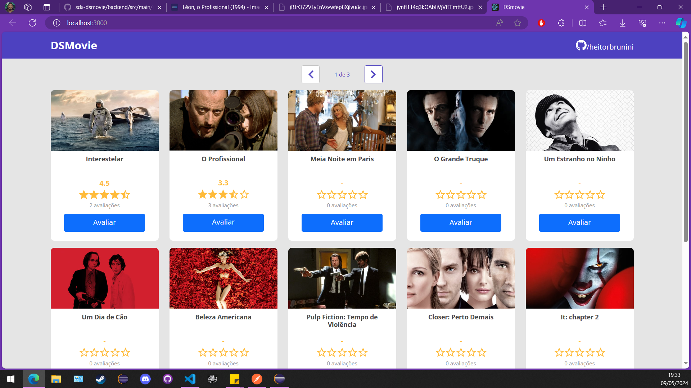

# Projeto SDS Dsmovie

Este é um projeto de filmes e avaliações de filmes, onde os usuários podem visualizar informações sobre os filmes e registrar suas avaliações. O sistema foi desenvolvido usando Spring Boot no backend e React no frontend.

*Figura 1: Imagem do Projeto*

## Funcionalidades

- **Visualização de Dados de Filmes:** Os dados dos filmes estão disponíveis publicamente e podem ser visualizados sem a necessidade de login.

- **Avaliações de Filmes:** Os usuários podem registrar avaliações para os filmes. Cada avaliação consiste em uma nota de 0 a 5.

- **Cálculo de Média de Notas:** Sempre que uma nova avaliação é registrada, o sistema calcula automaticamente a média das notas de todos os usuários para o filme em questão e armazena essa média na entidade Movie, junto com a contagem de votos.

*Figura 2: Diagrama de Classes do Backend*

## Tecnologias Utilizadas

- **Backend:** Spring Boot, JUnit 5
- **Frontend:** React

## Configuração do Ambiente de Desenvolvimento

1. **Clonar o Repositório:**

2. **Configurar o Backend:**
- Navegue até o diretório `backend` do projeto.
- Importe o diretório como projeto Maven na com o [SpringTools](https://spring.io/tools).

3. **Configurar o Frontend:**
- Navegue até o diretório `frontend` do projeto.
- Execute o comando `yarn install` para instalar as dependências do React.
- Execute o comando `yarn start` para iniciar o servidor de desenvolvimento do React.

4. **Acessar o Aplicativo:**
- O aplicativo estará disponível em `http://localhost:3000` por padrão.

## Testes (Backend)
- Este projeto inclui testes para os serviços ScoreService e MovieService utilizando JUnit 5 e Mockito.
- ScoreServiceTest: Testes para as funcionalidades do `ScoreService`.
- MovieServiceTest: Testes para as funcionalidades do `MovieService`.

## API Endpoints (Backend)

- **GET /movies** Retorna todos os filmes.
- **GET /movies?size=12page=0** Retorna uma lista de filmes de tamanho 12 começando índice 0.
- **GET /movies/{id}** Retorna detalhes de um filme específico.
- **POST /scores** Registra uma nova avaliação para um filme.

## Contribuição

Contribuições são bem-vindas! Sinta-se à vontade para abrir uma issue ou enviar um pull request.

## Licença

Este projeto é licenciado sob a Licença [MIT](https://opensource.org/licenses/MIT).
