## System/ Solution Overview

The software solution specified here is a Spring Boot application designed to manage movie categories. The primary purpose of this solution is to provide an API endpoint for retrieving a list of movie categories. This functionality is essential for applications that need to display or process movie categories, such as movie recommendation systems, movie databases, or any application that categorizes movies.

The main benefits of this solution include:
- Efficient retrieval of movie categories from the database.
- A well-structured and maintainable codebase following Spring Boot conventions.
- Scalability and ease of integration with other services or applications.

The objectives and goals of this solution are to ensure that movie categories can be retrieved quickly and accurately, providing a reliable backend service for any frontend application or other services that require this data.

## Functionality

#### Purpose/ Description

This section covers the specifications for the functionality related to retrieving movie categories. The primary focus is on the `findAll` method in the `CategoryController` class and its interaction with the `CategoryService` class.

- The `CategoryController` class is responsible for handling HTTP requests related to movie categories. It defines an endpoint `/categories` that clients can call to retrieve a list of all movie categories.
- When a GET request is made to the `/categories` endpoint, the `findAll` method in the `CategoryController` class is invoked.
- The `findAll` method in the `CategoryController` class calls the `findAll` method in the `CategoryService` class to retrieve the list of categories.
- The `CategoryService` class interacts with the `CategoryRepository` to fetch the data from the database.
- The `findAll` method in the `CategoryService` class returns the list of categories obtained from the `CategoryRepository`.
- The `CategoryController` then returns this list as the response to the client.

This sequence ensures that the data retrieval process is abstracted and follows a clean separation of concerns, making the codebase more maintainable and scalable.

## Use Case

UC-1: Retrieve Movie Categories

| Attribute                     | Description                                                | Data Requirement                                             |
|-------------------------------|------------------------------------------------------------|--------------------------------------------------------------|
| **Primary Actor(s)**          | User                                                       | User ID, User Profile                                        |
| **Stakeholders and Interest** | Users interested in movie categories                       | User roles and interests in movie categories                 |
| **Trigger**                   | User makes a GET request to the `/categories` endpoint     | HTTP GET request                                             |
| **Pre-conditions**            | The user must be authenticated                             | Valid authentication token                                   |
| **Post-conditions**           | The user receives a list of movie categories               | List of movie categories                                     |
| **Main Success Scenario**     | <ol><li>User sends a GET request to `/categories`.</li><li>The system processes the request.</li><li>The system returns a list of movie categories.</li></ol> | HTTP response with a list of movie categories                |
| **Extensions**                | None                                                       | None                                                         |
| **Exceptions**                | <ul><li>Authentication failure</li><li>Database connection failure</li></ul> | <ul><li>Error message indicating authentication failure</li><li>Error message indicating database connection failure</li></ul> |
| **Priority**                  | High                                                       | High priority for retrieving movie categories                |
| **Special Requirements**      | None                                                       | None                                                         |
| **Open Questions**            | None                                                       | None                                                         |

##### Use Case Diagram
Create the use case diagram using **Mermaid** syntax, which visually represents the interactions between actors and the system. The diagram should be based on the use case table above
Generate diagram only. DONT explain the code.
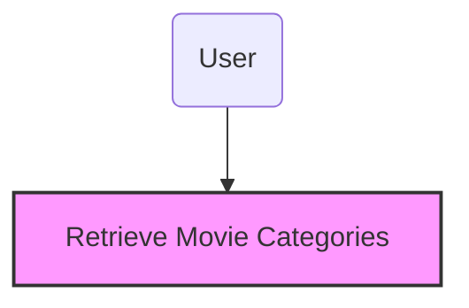

###### System Actors

###### User Roles and Responsibilities / Authority Requirements

| User/Role | Example | Frequency of Use | Security/Access, Features Used | Additional Notes |
|-----------|---------|------------------|--------------------------------|-------------------|
| User      | Movie Enthusiast | Frequent | Access to movie categories | None |

## Input parameters - Retrieve Movie Categories

| Parameter | Description | Data type | Default Value |
| --------- | ----------- |-----------|---------------|
| None      | No input parameters required for this endpoint | N/A | N/A |

## Output parameters - Retrieve Movie Categories

| Parameter | Description | Data type | Default Value |
| --------- | ----------- |-----------|---------------|
| categories | List of movie categories | List<Category> | N/A |

## Sequence diagram

### Component involve
    1. CategoryController
    2. CategoryService
    3. CategoryRepository

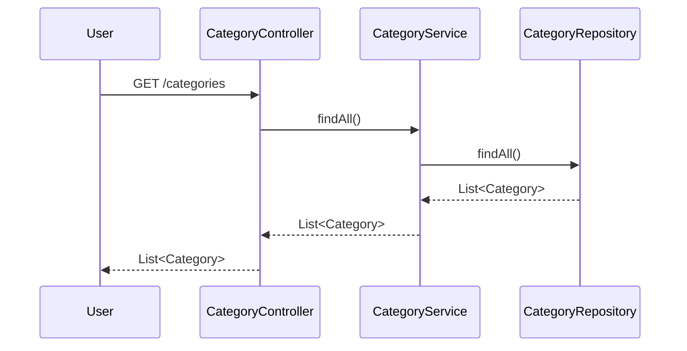

## Component diagram

### Component involve
    1. com.brunini.dsmovie.controllers
        - 1.1 CategoryController
    2. com.brunini.dsmovie.services
        - 2.1 CategoryService
    3. com.brunini.dsmovie.repositories
        - 3.1 CategoryRepository

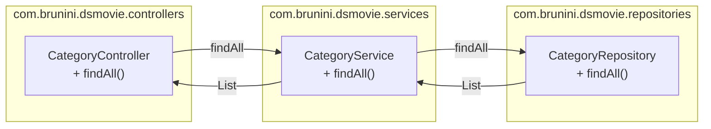

#### Reporting Requirements

There are no specific reporting requirements for this feature as it is primarily focused on data retrieval. However, logging and monitoring of the endpoint usage and performance can be considered for future enhancements.

#### Integration Requirements

This solution requires integration with a database to store and retrieve movie categories. The `CategoryRepository` interface is responsible for interacting with the database. The database should be properly configured and connected to the application.

#### Exception Handling/Error Reporting

| Exception/Error ID | Error | Cause | Solution Strategy |
|--------------------|-------|-------|--------------------|
| 401 | Authentication Failure | Invalid or missing authentication token | Return an error message indicating authentication failure |
| 500 | Database Connection Failure | Unable to connect to the database | Return an error message indicating database connection failure |

##### Additional Information

No additional information is provided for this feature.


## Post Category
- Requirement ID: REQ-01
- Headline: Ability to add a new category
- Description: This feature allows users to add a new category to the system. The user sends a POST request with the category details, and the system processes this request to create a new category entry in the database.
- Acceptance Criteria: 
  - Scenario 1: When a valid category is provided, the system successfully creates a new category entry in the database.
  - Scenario 2: If the category details are invalid, the system returns an appropriate error message.
- Data Requirement: 
  - Input: 
    - Category: The category details provided by the user. 
      - title: The title of the category. 
  - Output: 
    - None
- Pre Condition: The user must be authenticated.
- Post Condition: A new category entry is created in the database.

## System/ Solution Overview
This software solution is designed to manage movie categories. It allows users to add new categories, ensuring that the system's category list is always up-to-date. The primary benefit is to maintain an organized and comprehensive list of movie categories, which can be used for various purposes such as filtering and searching movies.

## Functionality
- The user sends a POST request to the `/categories` endpoint with the category details in the request body.
- The `CategoryController` receives the request and converts the category details into a `CategoryDTO` object.
- The `CategoryService` processes the `CategoryDTO` object and converts it into a `Category` entity.
- The `CategoryService` saves the `Category` entity to the database using the `CategoryRepository`.
- If the category details are valid, the system successfully creates a new category entry in the database.
- If the category details are invalid, the system returns an appropriate error message.

#### Purpose/ Description
The purpose of this feature is to allow users to add new categories to the system, ensuring that the category list is always up-to-date and comprehensive.

## Use Case

UC-1: Add New Category

| Attribute                     | Description                                                | Data Requirement                                             |
|-------------------------------|------------------------------------------------------------|--------------------------------------------------------------|
| **Primary Actor(s)**          | User                                                       | User ID, Category details (title)                             |
| **Stakeholders and Interest** | System administrators                                      | Ensure the category list is up-to-date and comprehensive.     |
| **Trigger**                   | User sends a POST request to add a new category.           | Category details (title)                                      |
| **Pre-conditions**            | User is authenticated.                                     | User ID                                                      |
| **Post-conditions**           | A new category entry is created in the database.           | Category details (title)                                      |
| **Main Success Scenario**     | <ol><li>User sends a POST request with category details.</li><li>System processes the request and creates a new category entry.</li><li>System returns a success response.</li></ol> | Category details (title)                                      |
| **Extensions**                | None                                                       | None                                                         |
| **Exceptions**                | <ol><li>If the category details are invalid, the system returns an error message.</li></ol> | Error message                                                |
| **Priority**                  | High                                                       | None                                                         |
| **Special Requirements**      | None                                                       | None                                                         |
| **Open Questions**            | None                                                       | None                                                         |

##### Use Case Diagram


###### System Actors

###### User Roles and Responsibilities / Authority Requirements

| User/Role | Example | Frequency of Use | Security/Access, Features Used | Additional Notes |
|-----------|---------|------------------|--------------------------------|-------------------|
| User      | Any authenticated user | Occasional | Can add new categories | None |

## Input parameters - Category

| Parameter | Description | Data type | Default Value |
| --------- | ----------- |-----------|---------------|
| title     | The title of the category | String | None |

## Output parameters - None

No output parameters.

## Sequence diagram

### Component involve
    1. CategoryController
    2. CategoryService
    3. CategoryRepository

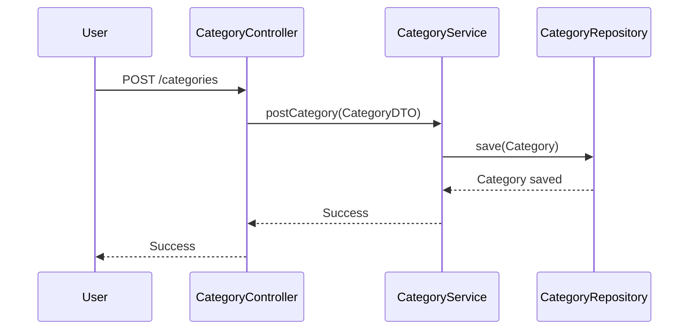

## Component diagram

### Component involve
    1. com.brunini.dsmovie.controllers
        - CategoryController
    2. com.brunini.dsmovie.services
        - CategoryService
    3. com.brunini.dsmovie.repositories
        - CategoryRepository

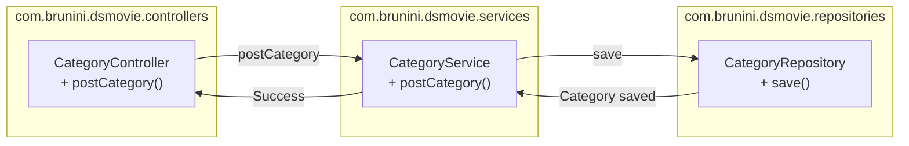

## Delete Category
- Requirement ID: REQ-01
- Headline: Ability to delete a category
- Description: The system should allow users to delete a category by providing the category details. The deletion process involves converting the category entity to a DTO and then invoking the service layer to delete the category from the repository.
- Acceptance Criteria: 
  - Scenario 1: When a valid category is provided, the category should be successfully deleted from the repository.
  - Scenario 2: If the category does not exist, an appropriate error message should be returned.
- Data Requirement: 
  - Input: 
    - Category: The category entity to be deleted. 
      - id: The unique identifier of the category. 
      - name: The name of the category. 
  - Output: 
    - None
- Pre Condition: The category must exist in the repository.
- Post Condition: The category is removed from the repository.

## System/ Solution Overview
The system is designed to manage movie categories. It provides functionality to delete a category by converting the category entity to a DTO and invoking the service layer to delete the category from the repository. This ensures that the category is removed from the system, maintaining data integrity and consistency.

## Functionality
- The `deleteCategory` method in the `CategoryController` class receives a category entity as input.
- The category entity is converted to a `CategoryDTO` object.
- The `deleteCategory` method in the `CategoryService` class is called with the `CategoryDTO` object.
- The `deleteCategory` method in the `CategoryService` class invokes the `deleteById` method of the `CategoryRepository` to delete the category from the repository.
- If the category does not exist, an appropriate error message is returned.

#### Purpose/ Description
The purpose of this functionality is to provide a way to delete a category from the system. This ensures that the system remains up-to-date and accurate, and that categories that are no longer needed can be removed.

## Use Case

UC-1: Delete Category

| Attribute                     | Description                                                | Data Requirement                                             |
|-------------------------------|------------------------------------------------------------|--------------------------------------------------------------|
| **Primary Actor(s)**          | User                                                       | User ID, Category details                                     |
| **Stakeholders and Interest** | Users who manage categories                                | Users need to be able to delete categories that are no longer needed. |
| **Trigger**                   | User initiates the delete category action                  | Category details                                             |
| **Pre-conditions**            | The category must exist in the repository.                 | Category ID                                                  |
| **Post-conditions**           | The category is removed from the repository.               | None                                                         |
| **Main Success Scenario**     | <ol><li>User provides category details.</li><li>System converts category to DTO.</li><li>System deletes category from repository.</li></ol> | Category details                                             |
| **Extensions**                | None                                                       | None                                                         |
| **Exceptions**                | Category does not exist                                    | Error message                                                |
| **Priority**                  | High                                                       | None                                                         |
| **Special Requirements**      | None                                                       | None                                                         |
| **Open Questions**            | None                                                       | None                                                         |

##### Use Case Diagram
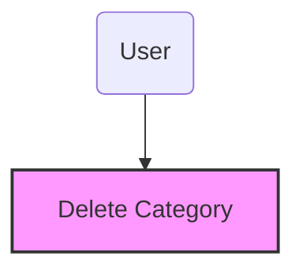

###### System Actors

###### User Roles and Responsibilities / Authority Requirements

| User/Role | Example | Frequency of Use | Security/Access, Features Used | Additional Notes |
|-----------|---------|------------------|--------------------------------|-------------------|
| User      | Admin   | Frequent         | Delete category                | None              |

## Input parameters - deleteCategory

| Parameter | Description | Data type | Default Value |
| --------- | ----------- |-----------|---------------|
| id        | The unique identifier of the category. | Long | None |
| name      | The name of the category. | String | None |

## Output parameters - deleteCategory

| Parameter | Description | Data type | Default Value |
| --------- | ----------- |-----------|---------------|
| None      | No output parameters. | None | None |

## Sequence diagram

### Component involve
    1. CategoryController
    2. CategoryService
    3. CategoryRepository

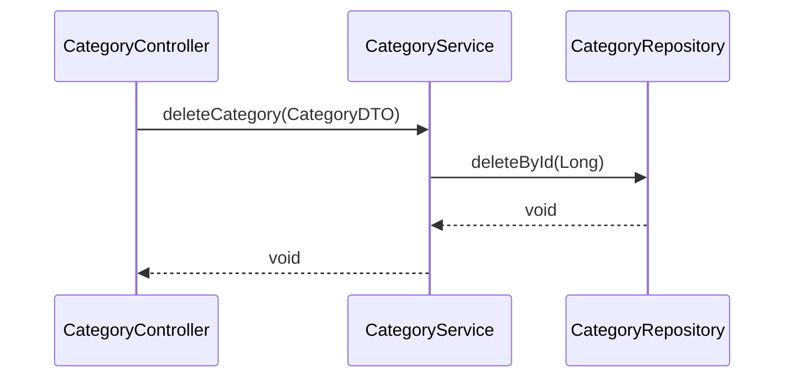

## Component diagram

### Component involve
    1. com.brunini.dsmovie.controllers
        - 1.1 CategoryController
    2. com.brunini.dsmovie.services
        - 2.1 CategoryService
    3. com.brunini.dsmovie.repositories

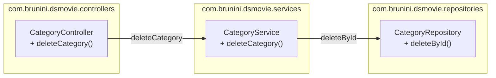

#### Reporting Requirements
No specific reporting requirements for this feature.

#### Integration Requirements
No specific integration requirements for this feature.

#### Exception Handling/Error Reporting

| Exception/Error ID | Error | Cause | Solution Strategy |
|--------------------|-------|-------|--------------------|
| 1                  | Category not found | The category does not exist in the repository. | Return an appropriate error message. |

##### Additional Information
No additional information.


## Update Category
- Requirement ID: REQ-01
- Headline: Ability to update a category
- Description: This feature allows users to update the details of an existing category. The user sends a request with the updated category details, and the system processes the request to update the category in the database.
- Acceptance Criteria: 
  - Scenario 1: If the category exists, the system updates the category details and saves them in the database.
  - Scenario 2: If the category does not exist, the system returns an error message indicating that the category was not found.
- Data Requirement: 
  - Input: The feature requires the updated category details, including the category ID and the new title.
  - Output: The feature produces an updated category record in the database.
- Pre Condition: The category to be updated must exist in the database.
- Post Condition: The category details are updated in the database.

## System/ Solution Overview
This software solution is designed to manage movie categories. It allows users to update the details of existing categories, ensuring that the category information remains current and accurate. The primary objective is to provide a seamless and efficient way to manage category data.

## Functionality
- The user sends a PUT request to the `/categories` endpoint with the updated category details in the request body.
- The `updateCategory` method in the `CategoryController` class receives the request and converts the request body into a `Category` object.
- A `CategoryDTO` object is created from the `Category` object.
- The `updateCategory` method in the `CategoryService` class is called with the `CategoryDTO` object.
- The `CategoryService` retrieves the existing category from the database using the category ID from the `CategoryDTO`.
- The category's title is updated with the new title from the `CategoryDTO`.
- The updated category is saved back to the database.
- If the category does not exist, an error is returned.

#### Purpose/ Description
The purpose of this feature is to allow users to update the details of existing categories in the system. This ensures that the category information remains accurate and up-to-date.

## Use Case

UC-1: Update Category

| Attribute | Description | Data Requirement |
|-------------------------------|------------------------------------------------------------|--------------------------------------------------------------|
| **Primary Actor(s)** | User | User ID, Category ID, Updated Category Details |
| **Stakeholders and Interest** | Users who manage categories | Users need to ensure category information is accurate |
| **Trigger** | User sends a PUT request to update a category | Updated category details |
| **Pre-conditions** | The category to be updated exists in the database | Existing category details |
| **Post-conditions** | The category details are updated in the database | Updated category details |
| **Main Success Scenario** | <ol><li>User sends a PUT request with updated category details.</li><li>The system retrieves the existing category from the database.</li><li>The system updates the category details and saves them in the database.</li></ol> | Updated category details |
| **Extensions** | None | None |
| **Exceptions** | <ol><li>If the category does not exist, the system returns an error message.</li></ol> | Error message indicating category not found |
| **Priority** | High | N/A |
| **Special Requirements** | None | N/A |
| **Open Questions** | None | N/A |

##### Use Case Diagram
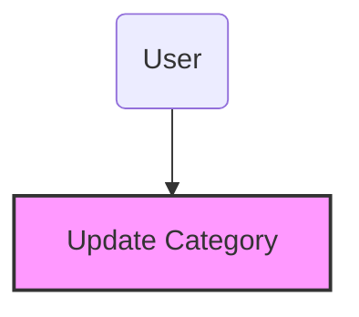

###### System Actors

###### User Roles and Responsibilities / Authority Requirements

| User/Role | Example | Frequency of Use | Security/Access, Features Used | Additional Notes |
|-----------|---------|------------------|--------------------------------|-------------------|
| User | Category Manager | Frequent | Can update category details | N/A |

## Input parameters - Update Category

| Parameter | Description | Data type | Default Value |
| --------- | ----------- |-----------|---------------|
| id | The unique identifier of the category | Long | N/A |
| title | The new title of the category | String | N/A |

## Output parameters - Update Category

| Parameter | Description | Data type | Default Value |
| --------- | ----------- |-----------|---------------|
| id | The unique identifier of the category | Long | N/A |
| title | The updated title of the category | String | N/A |

## Sequence diagram

### Component involve
1. CategoryController
2. CategoryService
3. CategoryRepository

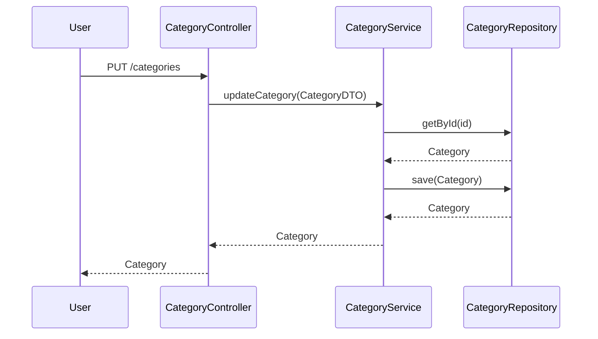

## Component diagram

### Component involve
1. com.brunini.dsmovie.controllers
    - CategoryController
2. com.brunini.dsmovie.services
    - CategoryService
3. com.brunini.dsmovie.repositories
    - CategoryRepository

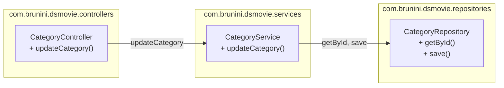

#### Reporting Requirements
N/A

#### Integration Requirements
N/A

#### Exception Handling/Error Reporting

| Exception/Error ID | Error | Cause | Solution Strategy |
|--------------------|-------|-------|--------------------|
| 1 | Category not found | The category ID does not exist in the database | Return an error message indicating that the category was not found |

##### Additional Information
N/A


## findAll
- Requirement ID: REQ-01
- Headline: Ability to view all movies with pagination
- Description: This feature allows users to retrieve a paginated list of all movies available in the system. The pagination ensures that the data is fetched in manageable chunks, improving performance and user experience.
- Acceptance Criteria: 
  - Scenario 1: When the user requests the first page of movies, the system returns the first set of movies based on the default page size.
  - Scenario 2: When the user requests a specific page number, the system returns the corresponding set of movies for that page.
  - Scenario 3: If there are no movies available, the system returns an empty list.
- Data Requirement: 
  - Input: Pageable object containing page number, page size, and sorting information.
  - Output: Page object containing a list of MovieDTO objects, total pages, total elements, and pagination details.
- Pre Condition: The movie database must be populated with movie records.
- Post Condition: The user receives a paginated list of movies based on the requested page number and size.

## System/ Solution Overview
The system is designed to manage and display a list of movies. The primary objective is to provide users with the ability to view movies in a paginated format, ensuring efficient data retrieval and display. This improves the user experience by allowing users to navigate through the movie list seamlessly.

## Functionality
- The `findAll` method in the `MovieController` class handles HTTP GET requests to the `/movies` endpoint.
- It accepts a `Pageable` object as a parameter, which contains pagination and sorting information.
- The method calls the `findAll` method of the `MovieService` class, passing the `Pageable` object.
- The `MovieService` class interacts with the `MovieRepository` to fetch the paginated list of movies from the database.
- The `findAll` method in `MovieService` returns a `Page` object containing `MovieDTO` objects, which are then returned to the client.
- The `MovieDTO` class is used to transfer movie data in a structured format.
- In case of any exceptions, appropriate error responses are returned to the client.

#### Purpose/ Description
The purpose of this specification is to detail the functionality of the `findAll` method and its related components. It aims to provide a clear understanding of how the system retrieves and displays paginated movie data.

## Use Case

UC-1: View Paginated Movies

| Attribute | Description | Data Requirement |
|-------------------------------|------------------------------------------------------------|--------------------------------------------------------------|
| **Primary Actor(s)** | User | User ID, Pageable object (page number, page size, sort) |
| **Stakeholders and Interest** | Users interested in viewing movies | User preferences for pagination and sorting |
| **Trigger** | User requests to view movies | Pageable object with pagination details |
| **Pre-conditions** | Movies are available in the database | Movie records in the database |
| **Post-conditions** | User receives a paginated list of movies | Paginated list of MovieDTO objects |
| **Main Success Scenario** | <ol><li>User requests the first page of movies.</li><li>System retrieves the first set of movies based on the default page size.</li><li>User views the paginated list of movies.</li></ol> | Pageable object, Page object with MovieDTOs |
| **Extensions** | User requests a specific page number | Pageable object with specific page number |
| **Exceptions** | No movies available | Empty list of movies |
| **Priority** | High | Efficient data retrieval and display |
| **Special Requirements** | None | N/A |
| **Open Questions** | None | N/A |

##### Use Case Diagram
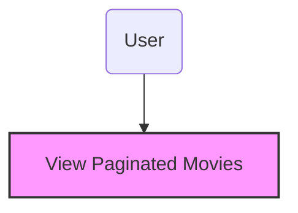

###### System Actors

###### User Roles and Responsibilities / Authority Requirements

| User/Role | Example | Frequency of Use | Security/Access, Features Used | Additional Notes |
|-----------|---------|------------------|--------------------------------|-------------------|
| User | Movie Enthusiast | Frequent | View movies | N/A |

## Input parameters - Pageable

| Parameter | Description | Data type | Default Value |
| --------- | ----------- |-----------|---------------|
| page | Page number to retrieve | int | 0 |
| size | Number of records per page | int | 10 |
| sort | Sorting criteria | String | N/A |

## Output parameters - Page

| Parameter | Description | Data type | Default Value |
| --------- | ----------- |-----------|---------------|
| content | List of MovieDTO objects | List<MovieDTO> | N/A |
| totalPages | Total number of pages | int | N/A |
| totalElements | Total number of elements | long | N/A |
| number | Current page number | int | N/A |
| size | Number of elements per page | int | N/A |
| sort | Sorting criteria | String | N/A |

## Sequence diagram

### Component involve
1. MovieController
2. MovieService
3. MovieRepository

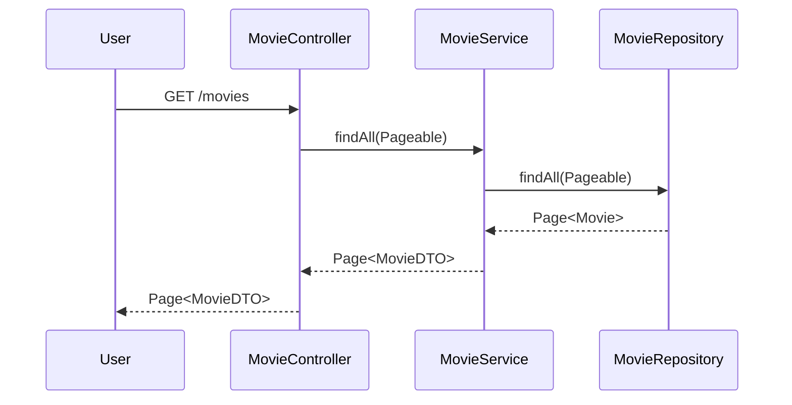

## Component diagram

### Component involve
1. com.brunini.dsmovie.controllers
    - MovieController
2. com.brunini.dsmovie.services
    - MovieService
3. com.brunini.dsmovie.repositories
    - MovieRepository

```mermaid
graph LR
    subgraph com.brunini.dsmovie.controllers
      MovieController["MovieController\n+ findAll(Pageable)"]
    end

    subgraph com.brunini.dsmovie.services
      MovieService["MovieService\n+ findAll(Pageable)"]
    end

    subgraph com.brunini.dsmovie.repositories
      MovieRepository["MovieRepository\n+ findAll(Pageable)"]
    end

    MovieController -->|findAll(Pageable)| MovieService
    MovieService -->|findAll(Pageable)| MovieRepository
    MovieRepository -->|Page<Movie>| MovieService
    MovieService -->|Page<MovieDTO>| MovieController
```

#### Reporting Requirements
The system should provide a report that includes the total number of movies, the number of pages, and the number of movies per page. The report should be accessible to administrators and should be generated on-demand.

#### Integration Requirements
The system should integrate with the movie database to fetch movie records. It should also support integration with external systems for importing and exporting movie data. The integration should be seamless and should not affect the performance of the system.

#### Exception Handling/Error Reporting

| Exception/Error ID | Error | Cause | Solution Strategy |
|--------------------|-------|-------|--------------------|
| 001 | No movies found | The movie database is empty | Return an empty list of movies |
| 002 | Database connection error | Unable to connect to the database | Log the error and return an appropriate error message to the user |

##### Additional Information
N/A


## Find Movie by ID
- Requirement ID: REQ-01
- Headline: Ability to view movie details by ID
- Description: This feature allows users to retrieve detailed information about a specific movie by providing its unique identifier (ID). The system will fetch the movie details from the database and return them to the user.
- Acceptance Criteria: 
  - Scenario 1: If the user provides a valid movie ID, the system returns the movie details.
  - Scenario 2: If the user provides an invalid movie ID, the system returns an error message indicating that the movie was not found.
- Data Requirement: 
  - Input: Movie ID (a unique identifier for the movie)
  - Output: Movie details including title, score, count, and image URL.
- Pre Condition: The movie must exist in the database.
- Post Condition: The movie details are returned to the user if the ID is valid.

## System/ Solution Overview
This software solution is designed to manage and retrieve movie details. The primary objective is to provide users with the ability to view detailed information about movies by querying the system with a unique movie ID. This feature enhances user experience by allowing quick access to movie information.

## Functionality
- The user sends a GET request to the endpoint `/movies/{id}` with the movie ID as a path variable.
- The `MovieController` receives the request and calls the `findById` method of the `MovieService`.
- The `MovieService` interacts with the `MovieRepository` to fetch the movie details from the database.
- The `MovieRepository` retrieves the movie entity from the database using the provided ID.
- The `MovieService` converts the movie entity to a `MovieDTO` object.
- The `MovieService` returns the `MovieDTO` object to the `MovieController`.
- The `MovieController` sends the `MovieDTO` object as the response to the user.
- If the movie ID is invalid, an exception is thrown, and an error message is returned to the user.

#### Purpose/ Description
The purpose of this specification is to outline the functionality and behavior of the feature that allows users to retrieve movie details by ID. This includes the interactions between the controller, service, and repository layers to fetch and return the movie details.

## Use Case

UC-1: Retrieve Movie Details by ID

| Attribute                     | Description                                                | Data Requirement                                             |
|-------------------------------|------------------------------------------------------------|--------------------------------------------------------------|
| **Primary Actor(s)**          | User                                                       | User ID, Movie ID                                            |
| **Stakeholders and Interest** | Users who want to view movie details                       | Movie details including title, score, count, and image URL   |
| **Trigger**                   | User sends a GET request to `/movies/{id}`                 | Movie ID                                                     |
| **Pre-conditions**            | The movie exists in the database                           | Valid Movie ID                                               |
| **Post-conditions**           | Movie details are returned to the user                     | Movie details including title, score, count, and image URL   |
| **Main Success Scenario**     | <ol><li>User sends a GET request to `/movies/{id}` with a valid movie ID.</li><li>The system retrieves the movie details from the database.</li><li>The system returns the movie details to the user.</li></ol> | Movie details including title, score, count, and image URL   |
| **Extensions**                | None                                                       | None                                                         |
| **Exceptions**                | <ol><li>If the movie ID is invalid, an error message is returned.</li></ol> | Error message indicating that the movie was not found        |
| **Priority**                  | High                                                       | N/A                                                          |
| **Special Requirements**      | None                                                       | N/A                                                          |
| **Open Questions**            | None                                                       | N/A                                                          |

##### Use Case Diagram
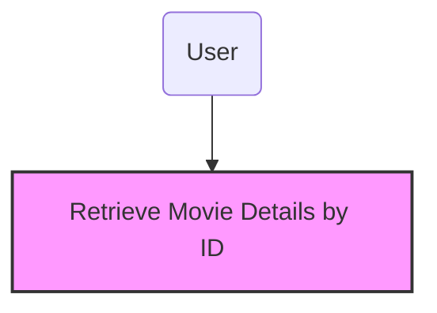

###### System Actors

###### User Roles and Responsibilities / Authority Requirements

| User/Role | Example | Frequency of Use | Security/Access, Features Used | Additional Notes |
|-----------|---------|------------------|--------------------------------|-------------------|
| User      | Movie Enthusiast | Frequent | Can view movie details | N/A |

## Input parameters - Movie ID

| Parameter | Description | Data type | Default Value |
| --------- | ----------- |-----------|---------------|
| Movie ID  | Unique identifier for the movie | Long | N/A |

## Output parameters - Movie Details

| Parameter | Description | Data type | Default Value |
| --------- | ----------- |-----------|---------------|
| Title     | Title of the movie | String | N/A |
| Score     | Average score of the movie | Double | N/A |
| Count     | Number of reviews for the movie | Integer | N/A |
| Image URL | URL of the movie's image | String | N/A |

## Sequence diagram

### Component involve
    1. MovieController
    2. MovieService
    3. MovieRepository

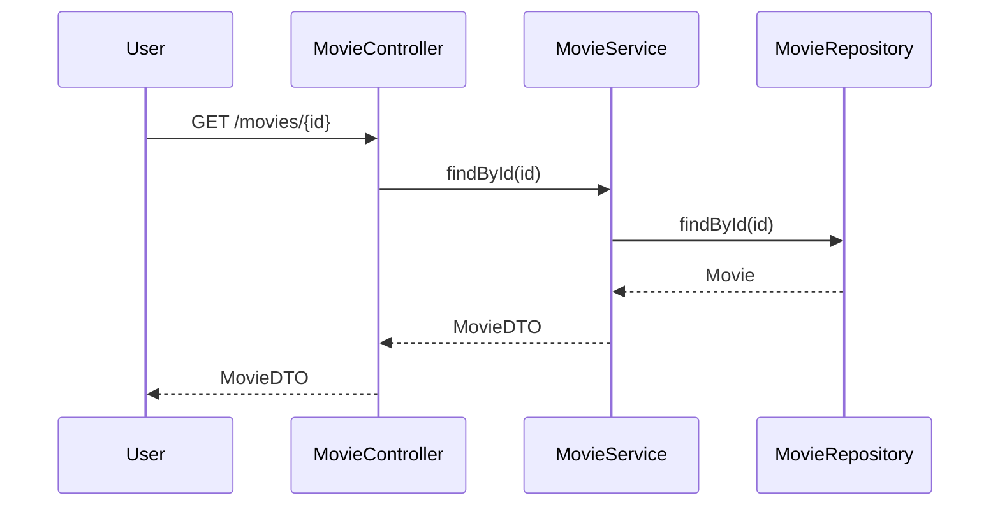

## Component diagram

### Component involve
    1. com.brunini.dsmovie.controllers
        - MovieController
    2. com.brunini.dsmovie.services
        - MovieService
    3. com.brunini.dsmovie.repositories
        - MovieRepository

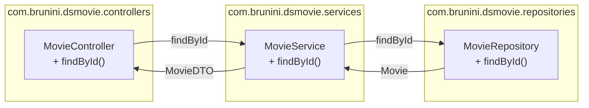

#### Reporting Requirements
N/A

#### Integration Requirements
N/A

#### Exception Handling/Error Reporting

| Exception/Error ID | Error | Cause | Solution Strategy |
|--------------------|-------|-------|--------------------|
| 404 | Movie not found | Invalid movie ID | Return error message indicating that the movie was not found |

##### Additional Information
N/A


## Find Movie by Title
- Requirement ID: REQ-01
- Headline: Ability to find a movie by its title
- Description: This feature allows users to search for a movie by its title. When a user provides a movie title, the system retrieves the movie details from the database and returns them to the user.
- Acceptance Criteria: 
  - Scenario 1: If the movie title exists in the database, the system returns the movie details.
  - Scenario 2: If the movie title does not exist in the database, the system returns an appropriate error message.
- Data Requirement: 
  - Input: Movie title (String) provided by the user.
  - Output: Movie details including title, director, release date, and rating.
- Pre Condition: The movie title must be provided by the user.
- Post Condition: The system returns the movie details or an error message.

## System/ Solution Overview
This software solution allows users to search for movies by their titles. The primary objective is to provide users with an easy and efficient way to find movie details. The system interacts with a database to retrieve the relevant movie information based on the provided title.

## Functionality
- The user sends a GET request to the endpoint `/movies/name/{title}` with the movie title as a path variable.
- The `MovieController` receives the request and calls the `findByTitle` method of the `MovieService`.
- The `MovieService` interacts with the `MovieRepository` to search for the movie by its title in the database.
- If the movie is found, the `MovieService` creates a `MovieDTO` object with the movie details and returns it to the `MovieController`.
- The `MovieController` sends the `MovieDTO` object as the response to the user.
- If the movie is not found, an appropriate error message is returned.

#### Purpose/ Description
The purpose of this feature is to enable users to find movie details by providing the movie title. This functionality is essential for users who want to quickly access information about a specific movie.

## Use Case

UC-1: Find Movie by Title

| Attribute                     | Description                                                | Data Requirement                                             |
|-------------------------------|------------------------------------------------------------|--------------------------------------------------------------|
| **Primary Actor(s)**          | User                                                       | Movie title (String) provided by the user.                   |
| **Stakeholders and Interest** | Users who want to find movie details                       | Movie details including title, director, release date, and rating. |
| **Trigger**                   | User sends a GET request to `/movies/name/{title}`         | Movie title (String) provided by the user.                   |
| **Pre-conditions**            | The movie title must be provided by the user.              | Movie title (String) provided by the user.                   |
| **Post-conditions**           | The system returns the movie details or an error message.  | Movie details including title, director, release date, and rating. |
| **Main Success Scenario**     | <ol><li>User sends a GET request to `/movies/name/{title}` with the movie title.</li><li>The system retrieves the movie details from the database.</li><li>The system returns the movie details to the user.</li></ol> | Movie details including title, director, release date, and rating. |
| **Extensions**                | None                                                       | None                                                         |
| **Exceptions**                | <ol><li>If the movie title does not exist, the system returns an error message.</li></ol> | Error message indicating that the movie title does not exist. |
| **Priority**                  | High                                                       | None                                                         |
| **Special Requirements**      | None                                                       | None                                                         |
| **Open Questions**            | None                                                       | None                                                         |

##### Use Case Diagram
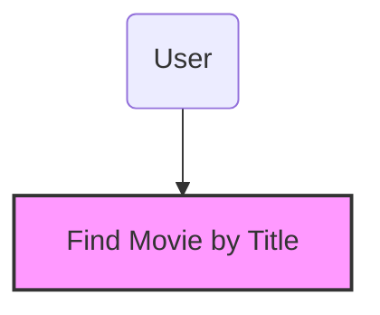

###### System Actors

###### User Roles and Responsibilities / Authority Requirements

| User/Role | Example | Frequency of Use | Security/Access, Features Used | Additional Notes |
|-----------|---------|------------------|--------------------------------|-------------------|
| User      | Movie Enthusiast | Frequent | Access to search for movies by title | None |

## Input parameters - Find Movie by Title

| Parameter | Description | Data type | Default Value |
| --------- | ----------- |-----------|---------------|
| title     | The title of the movie to be searched | String    | None          |

## Output parameters - Movie Details

| Parameter | Description | Data type | Default Value |
| --------- | ----------- |-----------|---------------|
| title     | The title of the movie | String    | None          |
| director  | The director of the movie | String    | None          |
| releaseDate | The release date of the movie | Date      | None          |
| rating    | The rating of the movie | Float     | None          |

## Sequence diagram

### Component involve
    1. MovieController
    2. MovieService
    3. MovieRepository

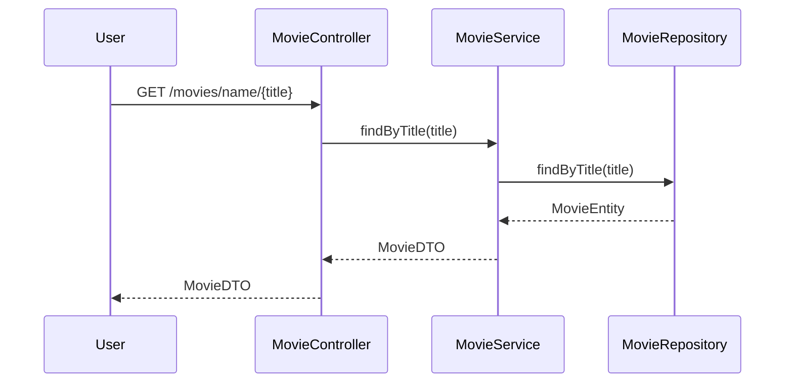

## Component diagram

### Component involve
    1. com.brunini.dsmovie.controllers
        - MovieController
    2. com.brunini.dsmovie.services
        - MovieService
    3. com.brunini.dsmovie.repositories
        - MovieRepository

```mermaid
graph LR
    subgraph com.brunini.dsmovie.controllers
      MovieController["MovieController\n+ findByTitle()"]
    end

    subgraph com.brunini.dsmovie.services
      MovieService["MovieService\n+ findByTitle()"]
    end

    subgraph com.brunini.dsmovie.repositories
      MovieRepository["MovieRepository\n+ findByTitle()"]
    end

    MovieController -->|findByTitle| MovieService
    MovieService -->|findByTitle| MovieRepository
```

#### Reporting Requirements
No specific reporting requirements for this feature.

#### Integration Requirements
This feature requires integration with the movie database to retrieve movie details based on the provided title. The integration involves querying the database for the movie title and returning the relevant details.

#### Exception Handling/Error Reporting

| Exception/Error ID | Error | Cause | Solution Strategy |
|--------------------|-------|-------|--------------------|
| 001                | Movie not found | The provided movie title does not exist in the database | Return an error message indicating that the movie title does not exist |

##### Additional Information
No additional information.


## FindByCategory
- Requirement ID: REQ-01
- Headline: Ability to filter movies by category
- Description: This feature allows users to filter and view movies based on a specific category. The user can specify a category, and the system will return a paginated list of movies that belong to that category.
- Acceptance Criteria: 
  - Scenario 1: If the user specifies a valid category, the system returns a paginated list of movies in that category.
  - Scenario 2: If the user specifies an invalid category, the system returns an empty list.
  - Scenario 3: If the user does not specify a category, the system returns an error message.
- Data Requirement: 
  - Input: 
    - category: The category of movies to filter by. (String)
    - pageable: Pagination information. (Pageable)
  - Output: 
    - A paginated list of movies in the specified category. (Page<MovieDTO>)
- Pre Condition: The category must exist in the system.
- Post Condition: The system returns a paginated list of movies in the specified category.

## System/ Solution Overview
This software solution is designed to provide users with the ability to filter and view movies based on specific categories. The primary objective is to enhance the user experience by allowing users to easily find movies that match their interests. The solution leverages Spring Boot to handle HTTP requests and interact with the database to retrieve movie data.

## Functionality
- The user sends a GET request to the `/movies/filter/{category}` endpoint with a specified category and pagination information.
- The `MovieController` receives the request and invokes the `findByCategory` method of the `MovieService`.
- The `MovieService` interacts with the `CategoryRepository` to find the category by name.
- The `MovieService` then interacts with the `MovieRepository` to find movies that belong to the specified category and applies pagination.
- The `MovieService` maps the retrieved movies to `MovieDTO` objects and returns a paginated list of `MovieDTO` objects to the `MovieController`.
- The `MovieController` returns the paginated list of `MovieDTO` objects as the response to the user.
- If the specified category does not exist, the `MovieService` returns an empty list.
- If the user does not specify a category, the system returns an error message.

#### Purpose/ Description
The purpose of this specification is to detail the functionality of filtering movies by category, including the input and output parameters, the interactions between components, and the expected behavior of the system.

## Use Case

UC-1: Filter Movies by Category

| Attribute                     | Description                                                | Data Requirement                                             |
|-------------------------------|------------------------------------------------------------|--------------------------------------------------------------|
| **Primary Actor(s)**          | User                                                       | User ID, Category Name, Pagination Information               |
| **Stakeholders and Interest** | Users who want to filter movies by category                | Users want to find movies that match their interests         |
| **Trigger**                   | User sends a GET request to the `/movies/filter/{category}` endpoint | Category Name, Pagination Information                        |
| **Pre-conditions**            | The category must exist in the system                      | Category Name                                                |
| **Post-conditions**           | The system returns a paginated list of movies in the specified category | Paginated List of Movies                                     |
| **Main Success Scenario**     | <ol><li>User sends a GET request to the `/movies/filter/{category}` endpoint with a valid category and pagination information.</li><li>The system retrieves the movies in the specified category and applies pagination.</li><li>The system returns a paginated list of movies in the specified category.</li></ol> | Category Name, Pagination Information, Paginated List of Movies |
| **Extensions**                | <ul><li>If the specified category does not exist, the system returns an empty list.</li></ul> | Category Name, Empty List                                    |
| **Exceptions**                | <ul><li>If the user does not specify a category, the system returns an error message.</li></ul> | Error Message                                                |
| **Priority**                  | High                                                       |                                                              |
| **Special Requirements**      | None                                                       |                                                              |
| **Open Questions**            | None                                                       |                                                              |

##### Use Case Diagram
```mermaid
graph TD
    actorUser(User) --> UC1[Filter Movies by Category]
    style UC1 fill:#f9f,stroke:#333,stroke-width:2px;
```

###### System Actors

###### User Roles and Responsibilities / Authority Requirements

| User/Role | Example | Frequency of Use | Security/Access, Features Used | Additional Notes |
|-----------|---------|------------------|--------------------------------|-------------------|
| User      | Movie Enthusiast | Frequent | Can filter movies by category | None |

## Input parameters - findByCategory

| Parameter | Description | Data type | Default Value |
| --------- | ----------- |-----------|---------------|
| category  | The category of movies to filter by | String | None |
| pageable  | Pagination information | Pageable | None |

## Output parameters - findByCategory

| Parameter | Description | Data type | Default Value |
| --------- | ----------- |-----------|---------------|
| Page<MovieDTO> | A paginated list of movies in the specified category | Page<MovieDTO> | None |

## Sequence diagram

### Component involve
    1. MovieController
    2. MovieService
    3. CategoryRepository
    4. MovieRepository

```mermaid
sequenceDiagram
    participant User
    participant MovieController
    participant MovieService
    participant CategoryRepository
    participant MovieRepository
    User->>MovieController: GET /movies/filter/{category}
    MovieController->>MovieService: findByCategory(category, pageable)
    MovieService->>CategoryRepository: findByName(category)
    MovieService->>MovieRepository: findByCategory(category, pageable)
    MovieRepository-->>MovieService: Page<Movie>
    MovieService-->>MovieController: Page<MovieDTO>
    MovieController-->>User: Page<MovieDTO>
```

## Component diagram

### Component involve
    1. com.brunini.dsmovie.controllers
        - MovieController
    2. com.brunini.dsmovie.services
        - MovieService
    3. com.brunini.dsmovie.repositories
        - CategoryRepository
        - MovieRepository

```mermaid
graph LR
    subgraph com.brunini.dsmovie.controllers
      MovieController["MovieController\n+ findByCategory()"]
    end

    subgraph com.brunini.dsmovie.services
      MovieService["MovieService\n+ findByCategory()"]
    end

    subgraph com.brunini.dsmovie.repositories
      CategoryRepository["CategoryRepository\n+ findByName()"]
      MovieRepository["MovieRepository\n+ findByCategory()"]
    end

    MovieController -->|findByCategory| MovieService
    MovieService -->|findByName| CategoryRepository
    MovieService -->|findByCategory| MovieRepository
```

#### Reporting Requirements
The system should provide a report of movies filtered by category, including the movie title, description, and other relevant details. The report should be accessible to users and should support pagination.

#### Integration Requirements
The system should integrate with the existing movie database to retrieve movie data. The integration should be seamless and should not affect the performance of the system. The system should also handle errors gracefully and provide meaningful error messages to the user.

#### Exception Handling/Error Reporting

| Exception/Error ID | Error | Cause | Solution Strategy |
|--------------------|-------|-------|--------------------|
| 1 | Invalid Category | The specified category does not exist | Return an empty list |
| 2 | Missing Category | The user did not specify a category | Return an error message |

##### Additional Information
None.

## Save Score
- Requirement ID: REQ-01
- Headline: Ability to save a user's score for a movie
- Description: This feature allows users to submit their scores for a specific movie. The score, along with the user's email and optional comment, is saved in the system. If the user does not exist in the system, a new user entry is created. The movie's average score and the number of scores are updated accordingly.
- Acceptance Criteria: 
  - Scenario 1: If the user submits a score for a movie, the score is saved, and the movie's average score and count are updated.
  - Scenario 2: If the user does not exist, a new user entry is created with the provided email.
  - Scenario 3: If the movie does not exist, an error is returned.
- Data Requirement: 
  - Input: 
    - User email: The email of the user submitting the score.
    - Movie ID: The ID of the movie being scored.
    - Score value: The score given by the user.
    - Comment: An optional comment provided by the user.
  - Output: 
    - Updated movie average score.
    - Updated movie score count.
    - Saved score entry.
- Pre Condition: The user must provide a valid email, movie ID, and score value.
- Post Condition: The score is saved, and the movie's average score and count are updated.

## System/ Solution Overview
This software solution allows users to submit their scores for movies. The system saves the scores, updates the movie's average score and count, and creates new user entries if necessary. This feature enhances user engagement and provides valuable feedback on movies.

## Functionality
- The user submits a score for a movie.
- The system checks if the user exists based on the provided email.
  - If the user does not exist, a new user entry is created.
- The system retrieves the movie based on the provided movie ID.
- The system creates a new score entry with the provided score value and optional comment.
- The system saves the score entry.
- The system calculates the new average score for the movie based on all scores.
- The system updates the movie's average score and count.
- The system saves the updated movie entry.
- If any error occurs (e.g., invalid movie ID), an appropriate error message is returned.

#### Purpose/ Description
The purpose of this feature is to allow users to submit their scores for movies, providing valuable feedback and enhancing user engagement. The system saves the scores, updates the movie's average score and count, and creates new user entries if necessary.

## Use Case

UC-1: Save User Score for Movie

| Attribute                     | Description                                                | Data Requirement                                             |
|-------------------------------|------------------------------------------------------------|--------------------------------------------------------------|
| **Primary Actor(s)**          | User                                                       | User email, Movie ID, Score value, Comment                   |
| **Stakeholders and Interest** | Movie Review Platform                                      | Accurate movie ratings and user feedback                     |
| **Trigger**                   | User submits a score for a movie                           | User email, Movie ID, Score value, Comment                   |
| **Pre-conditions**            | User provides valid email, movie ID, and score value       | Valid email, movie ID, and score value                       |
| **Post-conditions**           | Score is saved, movie's average score and count are updated| Updated movie average score and count, saved score entry     |
| **Main Success Scenario**     | <ol><li>User submits a score for a movie.</li><li>System checks if the user exists.</li><li>If user does not exist, a new user entry is created.</li><li>System retrieves the movie.</li><li>System creates a new score entry.</li><li>System saves the score entry.</li><li>System calculates the new average score for the movie.</li><li>System updates the movie's average score and count.</li><li>System saves the updated movie entry.</li></ol> | User email, Movie ID, Score value, Comment                   |
| **Extensions**                | User does not exist, movie does not exist                   | New user entry is created, error message is returned         |
| **Exceptions**                | Invalid movie ID, invalid score value                      | Error message is returned                                    |
| **Priority**                  | High                                                       |                                                              |
| **Special Requirements**      | None                                                       |                                                              |
| **Open Questions**            | None                                                       |                                                              |

##### Use Case Diagram
```mermaid
graph TD
    actorUser(User) --> UC1[Save User Score for Movie]
    style UC1 fill:#f9f,stroke:#333,stroke-width:2px;
```

###### System Actors

###### User Roles and Responsibilities / Authority Requirements

| User/Role | Example | Frequency of Use | Security/Access, Features Used | Additional Notes |
|-----------|---------|------------------|--------------------------------|-------------------|
| User      | Movie Reviewer | Frequent | Submit scores, view movie ratings | None |

## Input parameters - Save Score

| Parameter | Description | Data type | Default Value |
| --------- | ----------- |-----------|---------------|
| User email | The email of the user submitting the score | String | None |
| Movie ID | The ID of the movie being scored | Long | None |
| Score value | The score given by the user | Double | None |
| Comment | An optional comment provided by the user | String | None |

## Output parameters - Save Score

| Parameter | Description | Data type | Default Value |
| --------- | ----------- |-----------|---------------|
| Updated movie average score | The new average score of the movie | Double | None |
| Updated movie score count | The new count of scores for the movie | Integer | None |
| Saved score entry | The saved score entry | Score | None |

## Sequence diagram

### Component involve
    1. ScoreController
    2. ScoreService
    3. UserRepository
    4. MovieRepository
    5. ScoreRepository

```mermaid
sequenceDiagram
    participant ScoreController
    participant ScoreService
    participant UserRepository
    participant MovieRepository
    participant ScoreRepository
    ScoreController->>ScoreService: saveScore(ScoreDTO)
    ScoreService->>UserRepository: findByEmail(email)
    UserRepository-->>ScoreService: User
    ScoreService->>MovieRepository: findById(movieId)
    MovieRepository-->>ScoreService: Movie
    ScoreService->>ScoreRepository: saveAndFlush(Score)
    ScoreRepository-->>ScoreService: Score
    ScoreService->>MovieRepository: save(Movie)
    MovieRepository-->>ScoreService: Movie
    ScoreService-->>ScoreController: Score
```

## Component diagram

### Component involve
    1. com.brunini.dsmovie.controllers
        - ScoreController
    2. com.brunini.dsmovie.services
        - ScoreService
    3. com.brunini.dsmovie.repositories
        - UserRepository
        - MovieRepository
        - ScoreRepository

```mermaid
graph LR
    subgraph com.brunini.dsmovie.controllers
      ScoreController["ScoreController\n+ saveScore()"]
    end

    subgraph com.brunini.dsmovie.services
      ScoreService["ScoreService\n+ saveScore()"]
    end

    subgraph com.brunini.dsmovie.repositories
      UserRepository["UserRepository\n+ findByEmail()"]
      MovieRepository["MovieRepository\n+ findById()\n+ save()"]
      ScoreRepository["ScoreRepository\n+ saveAndFlush()"]
    end

    ScoreController -->|saveScore| ScoreService
    ScoreService -->|findByEmail| UserRepository
    ScoreService -->|findById| MovieRepository
    ScoreService -->|saveAndFlush| ScoreRepository
    ScoreService -->|save| MovieRepository
```

#### Reporting Requirements
This feature does not have specific reporting requirements. However, the system should be able to generate reports on movie scores, user submissions, and average movie ratings if needed in the future.

#### Integration Requirements
This feature integrates with the user, movie, and score repositories to save and retrieve data. It requires the following interfaces:
- UserRepository: Interface to manage user data.
- MovieRepository: Interface to manage movie data.
- ScoreRepository: Interface to manage score data.

#### Exception Handling/Error Reporting

| Exception/Error ID | Error | Cause | Solution Strategy |
|--------------------|-------|-------|--------------------|
| 001 | Invalid movie ID | The provided movie ID does not exist in the system | Return an error message indicating the invalid movie ID |
| 002 | Invalid score value | The provided score value is not within the valid range | Return an error message indicating the invalid score value |

##### Additional Information
No additional information.


## findAll
- Requirement ID: REQ-01
- Headline: Ability to view all scores
- Description: This feature allows users to retrieve a paginated list of all scores stored in the system. The scores are fetched from the database and returned in a paginated format to ensure efficient data handling and display.
- Acceptance Criteria: 
  - Scenario 1: When the user requests the first page of scores, the system returns the first set of scores based on the pagination parameters.
  - Scenario 2: When the user requests a specific page of scores, the system returns the corresponding set of scores for that page.
  - Scenario 3: If there are no scores in the database, the system returns an empty page.
- Data Requirement: 
  - Input: 
    - Pageable: Contains pagination information such as page number, page size, and sorting criteria.
  - Output: 
    - Page<ScoreDTO>: A paginated list of ScoreDTO objects, each representing a score with its details.
- Pre Condition: The database must contain score records.
- Post Condition: The user receives a paginated list of scores based on the requested page number and size.

## System/ Solution Overview
This software solution provides an API endpoint to retrieve a paginated list of scores. The primary objective is to enable efficient data retrieval and display for large datasets by implementing pagination. This ensures that users can navigate through scores without performance degradation.

## Functionality
- The `findAll` method in the `ScoreController` class handles GET requests to the `/scores` endpoint.
- It accepts a `Pageable` parameter that contains pagination information.
- The method calls the `findAll` method of the `ScoreService` class, passing the `Pageable` parameter.
- The `ScoreService` class interacts with the `ScoreRepository` to fetch the scores from the database.
- The scores are mapped to `ScoreDTO` objects and returned as a paginated list.
- If the database contains scores, the paginated list of `ScoreDTO` objects is returned.
- If the database is empty, an empty paginated list is returned.

#### Purpose/ Description
The purpose of this feature is to provide an efficient way to retrieve and display scores in a paginated format. This ensures that users can navigate through large datasets without experiencing performance issues.

## Use Case

UC-1: View Scores

| Attribute                     | Description                                                | Data Requirement                                             |
|-------------------------------|------------------------------------------------------------|--------------------------------------------------------------|
| **Primary Actor(s)**          | User                                                       | User ID, pagination parameters (page number, page size)       |
| **Stakeholders and Interest** | Users who want to view scores                              | User roles and permissions                                   |
| **Trigger**                   | User requests to view scores                               | Pagination parameters                                        |
| **Pre-conditions**            | Scores exist in the database                               | Database contains score records                              |
| **Post-conditions**           | User receives a paginated list of scores                   | Paginated list of ScoreDTO objects                           |
| **Main Success Scenario**     | <ol><li>User requests the first page of scores.</li><li>System returns the first set of scores based on pagination parameters.</li><li>User navigates to a specific page of scores.</li><li>System returns the corresponding set of scores for that page.</li></ol> | Pagination parameters, paginated list of ScoreDTO objects |
| **Extensions**                | User requests a page that does not exist                   | System returns an empty page                                 |
| **Exceptions**                | Database connection error                                  | System returns an error message                              |
| **Priority**                  | High                                                       | N/A                                                          |
| **Special Requirements**      | N/A                                                        | N/A                                                          |
| **Open Questions**            | N/A                                                        | N/A                                                          |

##### Use Case Diagram
```mermaid
graph TD
    actorUser(User) --> UC1[View Scores]
    style UC1 fill:#f9f,stroke:#333,stroke-width:2px;
```

###### System Actors

###### User Roles and Responsibilities / Authority Requirements

| User/Role | Example | Frequency of Use | Security/Access, Features Used | Additional Notes |
|-----------|---------|------------------|--------------------------------|-------------------|
| User      | N/A     | Frequent         | View scores                    | N/A               |

## Input parameters - findAll

| Parameter | Description | Data type | Default Value |
| --------- | ----------- |-----------|---------------|
| Pageable  | Contains pagination information such as page number, page size, and sorting criteria. | Object | N/A |

## Output parameters - findAll

| Parameter | Description | Data type | Default Value |
| --------- | ----------- |-----------|---------------|
| Page<ScoreDTO> | A paginated list of ScoreDTO objects, each representing a score with its details. | Object | N/A |

## Sequence diagram

### Component involve
    1. ScoreController
    2. ScoreService
    3. ScoreRepository

```mermaid
sequenceDiagram
    participant ScoreController
    participant ScoreService
    participant ScoreRepository
    ScoreController->>ScoreService: findAll(Pageable pageable)
    ScoreService->>ScoreRepository: findAll(Pageable pageable)
    ScoreRepository-->>ScoreService: Page<Score>
    ScoreService-->>ScoreController: Page<ScoreDTO>
```

## Component diagram

### Component involve
    1. com.brunini.dsmovie.controllers
        - 1.1 ScoreController
    2. com.brunini.dsmovie.services
        - 2.1 ScoreService
    3. com.brunini.dsmovie.repositories
        - 3.1 ScoreRepository

```mermaid
graph LR
    subgraph com.brunini.dsmovie.controllers
      ScoreController["ScoreController\n+ findAll(Pageable pageable)"]
    end

    subgraph com.brunini.dsmovie.services
      ScoreService["ScoreService\n+ findAll(Pageable pageable)"]
    end

    subgraph com.brunini.dsmovie.repositories
      ScoreRepository["ScoreRepository\n+ findAll(Pageable pageable)"]
    end

    ScoreController -->|"findAll(Pageable pageable)"| ScoreService
    ScoreService -->|"findAll(Pageable pageable)"| ScoreRepository
    ScoreRepository -->|"Page<Score>"| ScoreService
    ScoreService -->|"Page<ScoreDTO>"| ScoreController
```

#### Reporting Requirements
N/A

#### Integration Requirements
N/A

#### Exception Handling/Error Reporting

| Exception/Error ID | Error | Cause | Solution Strategy |
|--------------------|-------|-------|--------------------|
| 1                  | Database connection error | Unable to connect to the database | Return an error message to the user |

##### Additional Information
N/A


## System/ Solution Overview

The system in focus is a movie review application that allows users to view and interact with movie reviews. The primary objective of this system is to provide users with a platform to read, write, and manage movie reviews. The system aims to enhance user engagement by offering a seamless and intuitive interface for movie enthusiasts.

## Functionality

- The `UserController` class is responsible for handling HTTP requests related to user operations. It is mapped to the `/users` endpoint.
- The `findAll` method in the `UserController` class is designed to handle GET requests to the `/users` endpoint. It retrieves a list of all users in the system.
- The `UserService` class provides the business logic for user-related operations. It interacts with the `UserRepository` to fetch user data from the database.
- The `findAll` method in the `UserService` class fetches all user records from the database, converts them into `UserDTO` objects, and returns the list of `UserDTO` objects to the controller.
- The `UserRepository` interface is responsible for data access operations related to the `User` entity. It extends the `JpaRepository` interface, which provides standard CRUD operations.
- The `UserDTO` class is a Data Transfer Object that represents user data in a simplified form. It is used to transfer user data between the service and controller layers.

#### Purpose/ Description

The purpose of this section is to provide a detailed functional specification for the user-related operations in the movie review application. It covers the functionality implemented in the `UserController` and `UserService` classes, focusing on the retrieval of user data.

## Use Case

UC-1: Retrieve All Users

| Attribute                     | Description                                                | Data Requirement                                             |
|-------------------------------|------------------------------------------------------------|--------------------------------------------------------------|
| **Primary Actor(s)**          | User                                                       | User ID, User Profile                                        |
| **Stakeholders and Interest** | System Administrator                                       | Ensure data integrity and availability                       |
| **Trigger**                   | User requests to view all users                            | HTTP GET request to `/users` endpoint                        |
| **Pre-conditions**            | User is authenticated                                      | Valid authentication token                                   |
| **Post-conditions**           | List of users is returned                                  | List of `UserDTO` objects                                    |
| **Main Success Scenario**     | <ol><li>User sends a GET request to `/users` endpoint.</li><li>System retrieves all user records from the database.</li><li>System returns the list of `UserDTO` objects to the user.</li></ol> | User ID, User Profile                                        |
| **Extensions**                | None                                                       | None                                                         |
| **Exceptions**                | Database connection failure                                | Error message indicating database connection issue           |
| **Priority**                  | High                                                       | N/A                                                          |
| **Special Requirements**      | None                                                       | N/A                                                          |
| **Open Questions**            | None                                                       | N/A                                                          |

##### Use Case Diagram
Create the use case diagram using **Mermaid** syntax, which visually represents the interactions between actors and the system. The diagram should be base on the use case table above
Generate diagram only. DONT explain the code.
```mermaid
%% A simple use case diagram for a user interacting with a system

graph TD
    actorUser(User) --> UC1[Retrieve All Users]

    style UC1 fill:#f9f,stroke:#333,stroke-width:2px;
```

###### System Actors

###### User Roles and Responsibilities / Authority Requirements

| User/Role | Example | Frequency of Use | Security/Access, Features Used | Additional Notes |
|-----------|---------|------------------|--------------------------------|-------------------|
| User      | Movie Enthusiast | Frequent | View user profiles | N/A |
| Admin     | System Administrator | Occasional | Manage user data | N/A |


## Input parameters - findAll

| Parameter | Description | Data type | Default Value |
| --------- | ----------- |-----------|---------------|
| None      | No input parameters required for this method | N/A       | N/A           |

## Output parameters - findAll

| Parameter | Description | Data type | Default Value |
| --------- | ----------- |-----------|---------------|
| UserDTO   | Data Transfer Object representing user data | List<UserDTO> | N/A           |

## Sequence diagram

### Component involve
    1. UserController
    2. UserService
    3. UserRepository

```mermaid
sequenceDiagram
    participant UserController
    participant UserService
    participant UserRepository
    UserController->>UserService: findAll()
    UserService->>UserRepository: findAll()
    UserRepository-->>UserService: List<User>
    UserService-->>UserController: List<UserDTO>
```

## Component diagram

### Component involve
    1. com.brunini.dsmovie.controllers
        - UserController
    2. com.brunini.dsmovie.services
        - UserService
    3. com.brunini.dsmovie.repositories
        - UserRepository

```mermaid
    graph LR
        %% Define first service with its components
        subgraph "com.brunini.dsmovie.controllers"
          UserController["UserController\n+ findAll()"]
        end

        %% Define second service with its components
        subgraph "com.brunini.dsmovie.services"
          UserService["UserService\n+ findAll()"]
        end

        %% Define third service with its components
        subgraph "com.brunini.dsmovie.repositories"
          UserRepository["UserRepository\n+ findAll()"]
        end

        %% Define interactions between components
        UserController -->|"findAll()"| UserService
        UserService -->|"findAll()"| UserRepository
        UserRepository -->|"List<User>"| UserService
        UserService -->|"List<UserDTO>"| UserController
```

#### Reporting Requirements

The system should provide a report that lists all users in the system. The report should include user IDs, names, and profiles. The report should be accessible to system administrators and should be generated in a format that can be easily exported to CSV or PDF.

#### Integration Requirements

The system should integrate with an authentication service to ensure that only authenticated users can access the user data. The integration should be seamless and should not impact the performance of the system. The system should also integrate with a database to store and retrieve user data.

#### Exception Handling/Error Reporting

| Exception/Error ID | Error | Cause | Solution Strategy |
|--------------------|-------|-------|--------------------|
| DB_CONN_FAIL       | Database connection failure | Unable to connect to the database | Retry the connection and log the error for further investigation |

##### Additional Information

N/A


## postCategory
- Requirement ID: REQ-01
- Headline: Ability to create a new user
- Description: This feature allows the creation of a new user by accepting user details and saving them to the database.
- Acceptance Criteria: 
  - Scenario 1: When a valid user detail is provided, the user should be successfully created and saved in the database.
  - Scenario 2: If the user detail is invalid, the user should not be created, and an appropriate error message should be returned.
- Data Requirement: 
  - Input: 
    - UserDTO: An object containing user details.
      - email: The email address of the user.
  - Output: 
    - None
- Pre Condition: The user details must be valid and not already exist in the database.
- Post Condition: A new user is created and saved in the database if the input is valid.

## System/ Solution Overview
The system is designed to manage user data for the DSMovie application. It provides functionality to create new users by accepting user details and saving them to the database. The primary objective is to ensure that user data is accurately captured and stored, facilitating user management within the application.

## Functionality
- The `postCategory` method in the `UserController` class is responsible for handling HTTP POST requests to create a new user.
- It accepts a `UserDTO` object containing user details as input.
- The method invokes the `postUser` method of the `UserService` class, passing the `UserDTO` object.
- The `postUser` method in the `UserService` class is responsible for saving the user details to the database.
- It converts the `UserDTO` object to a `User` entity and uses the `UserRepository` to save the user data.
- If the user details are valid, the user is successfully created and saved in the database.
- If the user details are invalid, an appropriate error message is returned.

#### Purpose/ Description
The purpose of this specification is to outline the functionality and requirements for creating a new user in the DSMovie application. It provides a detailed description of the input and output data, acceptance criteria, and the steps involved in the process.

## Use Case

UC-1: Create New User

| Attribute | Description | Data Requirement |
|-----------|-------------|------------------|
| **Primary Actor(s)** | User | UserDTO object containing user details |
| **Stakeholders and Interest** | Application users who need to create an account | User details including email address |
| **Trigger** | User submits a request to create a new account | Valid user details |
| **Pre-conditions** | User details must be valid and not already exist in the database | Valid email address |
| **Post-conditions** | A new user is created and saved in the database | User data is stored in the database |
| **Main Success Scenario** | <ol><li>User submits valid details.</li><li>System validates the details.</li><li>User is created and saved in the database.</li></ol> | User data is stored in the database |
| **Extensions** | None | None |
| **Exceptions** | Invalid user details | Appropriate error message |
| **Priority** | High | User creation is a critical feature |
| **Special Requirements** | None | None |
| **Open Questions** | None | None |

##### Use Case Diagram
```mermaid
graph TD
    actorUser(User) --> UC1[Create New User]
    style UC1 fill:#f9f,stroke:#333,stroke-width:2px;
```

###### System Actors

###### User Roles and Responsibilities / Authority Requirements

| User/Role | Example | Frequency of Use | Security/Access, Features Used | Additional Notes |
|-----------|---------|------------------|--------------------------------|-------------------|
| User | Application user | Frequent | Can create a new account | None |

## Input parameters - UserDTO

| Parameter | Description | Data type | Default Value |
|-----------|-------------|-----------|---------------|
| email | The email address of the user | String | None |

## Output parameters - None

| Parameter | Description | Data type | Default Value |
|-----------|-------------|-----------|---------------|
| None | No output parameters | None | None |

## Sequence diagram

### Component involve
1. UserController
2. UserService
3. UserRepository

```mermaid
sequenceDiagram
    participant UserController
    participant UserService
    participant UserRepository
    UserController->>UserService: postUser(UserDTO)
    UserService-->>UserRepository: save(User)
    UserRepository-->>UserService: User saved
    UserService-->>UserController: User created
```

## Component diagram

### Component involve
1. com.brunini.dsmovie.controllers
    - UserController
2. com.brunini.dsmovie.services
    - UserService
3. com.brunini.dsmovie.repositories
    - UserRepository

```mermaid
graph LR
    subgraph com.brunini.dsmovie.controllers
      UserController["UserController\n+ postCategory()"]
    end

    subgraph com.brunini.dsmovie.services
      UserService["UserService\n+ postUser()"]
    end

    subgraph com.brunini.dsmovie.repositories
      UserRepository["UserRepository\n+ save()"]
    end

    UserController -->|"postUser"| UserService
    UserService -->|"save"| UserRepository
```

#### Reporting Requirements
There are no specific reporting requirements for this feature.

#### Integration Requirements
This feature requires integration with the database to save user details. The `UserRepository` interface is used to interact with the database.

#### Exception Handling/Error Reporting

| Exception/Error ID | Error | Cause | Solution Strategy |
|--------------------|-------|-------|--------------------|
| 001 | Invalid user details | User details do not meet validation criteria | Return an appropriate error message |

##### Additional Information
No additional information.


## Delete User
- Requirement ID: REQ-01
- Headline: Ability to delete a user
- Description: The system should allow the deletion of a user from the database. This feature is essential for maintaining the integrity and relevance of the user data. When a user is deleted, all associated data should be removed from the system.
- Acceptance Criteria: 
  - Scenario 1: When a valid user ID is provided, the user should be successfully deleted from the database.
  - Scenario 2: If the user ID does not exist, the system should handle the error gracefully and provide an appropriate message.
- Data Requirement: 
  - Input: UserDTO object containing the user ID.
  - Output: None.
- Pre Condition: The user must exist in the database.
- Post Condition: The user is removed from the database.

## System/ Solution Overview
The system is designed to manage user data, including the ability to delete users. This feature ensures that outdated or irrelevant user data can be removed, maintaining the integrity of the database. The primary objective is to provide a seamless and efficient way to manage user data.

## Functionality
- The `deleteCategory` method in the `UserController` class receives a `UserDTO` object containing the user ID to be deleted.
- The method calls the `deleteUser` method in the `UserService` class, passing the `UserDTO` object.
- The `deleteUser` method in the `UserService` class calls the `deleteById` method of the `UserRepository` class, passing the user ID.
- The `deleteById` method removes the user from the database.
- If the user ID does not exist, the system handles the error gracefully.

#### Purpose/ Description
The purpose of this feature is to provide a way to delete users from the system, ensuring that the user data remains relevant and up-to-date.

## Use Case

UC-1: Delete User

| Attribute                     | Description                                                | Data Requirement                                             |
|-------------------------------|------------------------------------------------------------|--------------------------------------------------------------|
| **Primary Actor(s)**          | User                                                       | User ID                                                      |
| **Stakeholders and Interest** | System Administrator                                       | Ensure data integrity and relevance                          |
| **Trigger**                   | User initiates a delete request                            | User ID                                                      |
| **Pre-conditions**            | User exists in the database                                | User ID                                                      |
| **Post-conditions**           | User is removed from the database                          | None                                                         |
| **Main Success Scenario**     | <ol><li>User initiates delete request.</li><li>System receives UserDTO object.</li><li>System deletes user from database.</li></ol> | User ID                                                      |
| **Extensions**                | None                                                       | None                                                         |
| **Exceptions**                | User ID does not exist                                     | Error message                                                |
| **Priority**                  | High                                                       | None                                                         |
| **Special Requirements**      | None                                                       | None                                                         |
| **Open Questions**            | None                                                       | None                                                         |

##### Use Case Diagram
```mermaid
%% A simple use case diagram for a user interacting with a system

graph TD
    actorUser(User) --> UC1[Delete User]

    style UC1 fill:#f9f,stroke:#333,stroke-width:2px;
```

###### System Actors

###### User Roles and Responsibilities / Authority Requirements

| User/Role | Example | Frequency of Use | Security/Access, Features Used | Additional Notes |
|-----------|---------|------------------|--------------------------------|-------------------|
| User      | John Doe| Occasional       | Delete User                    | None              |

## Input parameters - UserDTO

| Parameter | Description | Data type | Default Value |
| --------- | ----------- |-----------|---------------|
| id        | User ID     | Long      | None          |

## Output parameters - None

## Sequence diagram

### Component involve
    1. UserController
    2. UserService
    3. UserRepository

```mermaid
sequenceDiagram
    participant UserController
    participant UserService
    participant UserRepository
    UserController->>UserService: deleteUser(UserDTO)
    UserService->>UserRepository: deleteById(Long)
    UserRepository-->>UserService: None
    UserService-->>UserController: None
```

## Component diagram

### Component involve
    1. com.brunini.dsmovie.controllers
        - 1.1 UserController
    2. com.brunini.dsmovie.services
        - 2.1 UserService
    3. com.brunini.dsmovie.repositories

```mermaid
    graph LR
        %% Define first service with its components
        subgraph "com.brunini.dsmovie.controllers"
          UserController["UserController\n+ deleteCategory()"]
        end

        %% Define second service with its components
        subgraph "com.brunini.dsmovie.services"
          UserService["UserService\n+ deleteUser()"]
        end

        %% Define third service with its components
        subgraph "com.brunini.dsmovie.repositories"
          UserRepository["UserRepository\n+ deleteById()"]
        end

        %% Define interactions between components
        UserController -->|"deleteCategory"| UserService
        UserService -->|"deleteUser"| UserRepository
```

#### Reporting Requirements
No specific reporting requirements for this feature.

#### Integration Requirements
No specific integration requirements for this feature.

#### Exception Handling/Error Reporting

| Exception/Error ID | Error | Cause | Solution Strategy |
|--------------------|-------|-------|--------------------|
| 1                  | User not found | User ID does not exist in the database | Provide an appropriate error message to the user |

##### Additional Information
No additional information.


## findById
- Requirement ID: REQ-01
- Headline: Ability to view user details by ID
- Description: This feature allows users to retrieve detailed information about a specific user by providing their unique ID. The system will fetch the user details from the database and return them in a structured format.
- Acceptance Criteria: 
  - Scenario 1: When a valid user ID is provided, the system returns the user details.
  - Scenario 2: When an invalid user ID is provided, the system returns an error message indicating that the user was not found.
- Data Requirement: 
  - Input: User ID (a unique identifier for the user)
  - Output: User details including ID, name, email, and other relevant information.
- Pre Condition: The user must exist in the database.
- Post Condition: The user details are retrieved and displayed to the requester.

## System/ Solution Overview
This software solution is designed to manage and retrieve user information. The primary objective is to provide a seamless way to access user details by their unique ID. This feature is beneficial for administrators and other stakeholders who need to view user information quickly and efficiently.

## Functionality
- The `findById` method in the `UserController` class is responsible for handling HTTP GET requests to retrieve user details by ID.
- The method receives the user ID as a path variable and calls the `findById` method in the `UserService` class.
- The `UserService` class interacts with the `UserRepository` to fetch the user details from the database.
- The user details are then converted into a `UserDTO` object and returned to the controller.
- The controller sends the `UserDTO` object as the response to the client.
- If the user ID is invalid, an appropriate error message is returned.

#### Purpose/ Description
The purpose of this feature is to provide a way to retrieve user details by their unique ID. This is essential for various administrative and user management tasks.

## Use Case

UC-1: Retrieve User Details by ID

| Attribute | Description | Data Requirement |
|-------------------------------|------------------------------------------------------------|--------------------------------------------------------------|
| **Primary Actor(s)** | Administrator, User | User ID (unique identifier) |
| **Stakeholders and Interest** | Administrators need to view user details for management purposes. | User details including ID, name, email, etc. |
| **Trigger** | A request to view user details by ID. | User ID |
| **Pre-conditions** | The user must exist in the database. | User ID |
| **Post-conditions** | The user details are retrieved and displayed. | User details |
| **Main Success Scenario** | <ol><li>The user sends a request with a valid user ID.</li><li>The system retrieves the user details from the database.</li><li>The system returns the user details to the requester.</li></ol> | User details |
| **Extensions** | None | None |
| **Exceptions** | <ol><li>If the user ID is invalid, an error message is returned.</li></ol> | Error message |
| **Priority** | High | N/A |
| **Special Requirements** | None | N/A |
| **Open Questions** | None | N/A |

##### Use Case Diagram
```mermaid
%% A simple use case diagram for a user interacting with a system

graph TD
    actorUser(User) --> UC1[Retrieve User Details by ID]

    style UC1 fill:#f9f,stroke:#333,stroke-width:2px;
```

###### System Actors

###### User Roles and Responsibilities / Authority Requirements

| User/Role | Example | Frequency of Use | Security/Access, Features Used | Additional Notes |
|-----------|---------|------------------|--------------------------------|-------------------|
| Administrator | Admin User | Frequent | Full access to user details | N/A |
| User | Regular User | Occasional | Limited access to own details | N/A |

## Input parameters - findById

| Parameter | Description | Data type | Default Value |
| --------- | ----------- |-----------|---------------|
| User ID | Unique identifier for the user | Long | N/A |

## Output parameters - findById

| Parameter | Description | Data type | Default Value |
| --------- | ----------- |-----------|---------------|
| User ID | Unique identifier for the user | Long | N/A |
| Name | Name of the user | String | N/A |
| Email | Email address of the user | String | N/A |

## Sequence diagram

### Component involve
    1. UserController
    2. UserService
    3. UserRepository

```mermaid
sequenceDiagram
    participant UserController
    participant UserService
    participant UserRepository
    UserController->>UserService: findById(id)
    UserService->>UserRepository: getById(id)
    UserRepository-->>UserService: UserEntity
    UserService-->>UserController: UserDTO
```

## Component diagram

### Component involve
    1. com.brunini.dsmovie.controllers
        - 1.1 UserController
    2. com.brunini.dsmovie.services
        - 2.1 UserService
    3. com.brunini.dsmovie.repositories
        - 3.1 UserRepository

```mermaid
    graph LR
        %% Define first service with its components
        subgraph "com.brunini.dsmovie.controllers"
          UserController["UserController\n+ findById()"]
        end

        %% Define second service with its components
        subgraph "com.brunini.dsmovie.services"
          UserService["UserService\n+ findById()"]
        end

        %% Define third service with its components
        subgraph "com.brunini.dsmovie.repositories"
          UserRepository["UserRepository\n+ getById()"]
        end

        %% Define interactions between components
        UserController -->|"findById"| UserService
        UserService -->|"getById"| UserRepository
        UserRepository -->|"UserEntity"| UserService
        UserService -->|"UserDTO"| UserController
```

#### Reporting Requirements
N/A

#### Integration Requirements
N/A

#### Exception Handling/Error Reporting

| Exception/Error ID | Error | Cause | Solution Strategy |
|--------------------|-------|-------|--------------------|
| 1 | User not found | Invalid user ID | Return an error message indicating the user was not found |

##### Additional Information
N/A


